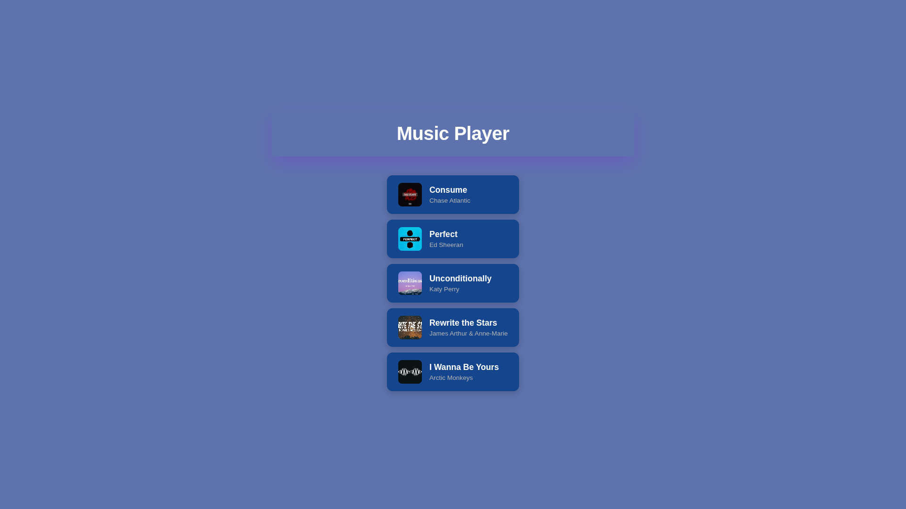

**Player de música com sincronização de letras (lyrics)** feito em **HTML, CSS e JavaScript**.  

O player permite reproduzir músicas e exibir as letras de forma sincronizada com o tempo da faixa.  

---

## 🚀 Funcionalidades

- ▶️ **Play/Pause** da música  
- ⏩ **Avançar e retroceder** na faixa  
- ⏱️ **Sincronização de letras** (lyrics com timestamps em segundos)  
- 🎶 **Exibição dinâmica** da letra atual conforme o progresso da música   

---

## 📂 Estrutura do Projeto

tocadorMusic/
│── assets/
│ ├── audio/ # Arquivos de música (.mp3)
│ ├── images/ # Capas de música
│ └── videos/ # Vídeos de fundo
│
│── public/
│ ├── media/ # Arquivos de media publicos
│
│── src/
│ ├── script.js # Lógica de reprodução e sincronização das letras
│ └── style.css # Estilização do player
│
│── .gitignore # Ignora arquivos no Git
│── index.html # Estrutura principal do player
│── README.md # Documentação do projeto
---

## 🛠️ Como Usar

1. Clone este repositório:
   ```bash
   git clone https://github.com/andrewSouza-dev/music-player.git
Adicione sua música em assets/audio, o video de fundo em assets/videos e a capa em assets/images.

Edite o arquivo script.js para colocar as letras com timestamps, por exemplo:

js
Copiar código
  lyrics = [
  { time: 1, text: "I've been too busy ignoring and hiding" },
  { time: 5, text: "About what my heart actually say" },
  { time: 12, text: "Stay awake while I'm drowning on my thoughts" },
  { time: 20, text: "So many things I wanna say" },
];
Abra o arquivo index.html no navegador.

## 🖼️ Exemplo de Interface


## 📌 Tecnologias Utilizadas
HTML5

CSS3

JavaScript (ES6+)

## ✨ Melhorias Futuras

 Suporte a playlist

 Importar letras automaticamente de uma API

 Tema claro/escuro

## 📄 Licença
Este projeto é open-source e pode ser utilizado livremente.